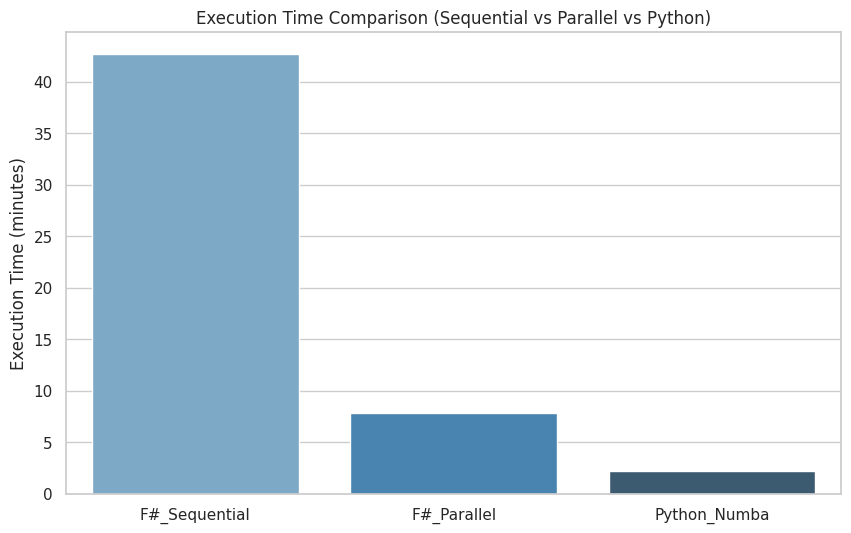

## F# + C# Project Installation

1. **Install .NET 9.0**
   Download and install from:
   [https://dotnet.microsoft.com/en-us/download/dotnet/9.0](https://dotnet.microsoft.com/en-us/download/dotnet/9.0)

2. **Restore Project Dependencies**

   ```sh
   dotnet restore main/PortfolioOptimization.csproj
   ```

3. **Build Core Library**

   ```sh
   dotnet build CoreLib/CoreLib.fsproj
   ```

4. **Build Main Project**

   ```sh
   dotnet build main/PortfolioOptimization.csproj
   ```

5. **Run Main Project**
   This will execute both profilers and write the results to the `/log` directory:

   ```sh
   dotnet run --project main
   ```

## Python API Usage

* **Create a virtual environment**:

  ```sh
  cd api
  python3 -m venv venv
  source venv/bin/activate
  ```

* **Install the required dependencies**:

  ```sh
  pip install -r requirements.txt
  ```

* **Run the API**:

  ```sh
  python api.py
  ```

## Project Structure

* [`/api`](api/)

  * Contains `api.py` and `query.py`, which were used to fetch DOW data using the Yahoo Finance library and store it locally in CSV format, allowing for C# to read and load.

* [`/CoreLib`](CoreLib/)

  * Contains all of the F# code used in the project.
  * [`/CoreLib/Core.fs`](CoreLib/Core.fs): Contains the core functions of the project—those that calculate the Sharpe ratio sequentially, in parallel, and the `getSharpe` function that contains the Sharpe formula.
  * [`/CoreLib/Types.fs`](CoreLib/Types.fs): Contains the shared types between C# and F#.

* [`/main`](main/)

  * The entry point of the program. Contains all of the C# functions and logic that abstract away side effects.
  * [`/main/DataLoad`](main/DataLoad/): Contains CsvHelper-based functions that read CSV files and return the necessary data structures to dispatch to F#.
  * [`/main/Profilers`](main/Profilers/): Contains functors that receive the F#-defined functions, time their execution, and write results to logs.
  * [`/main/Program.cs`](main/Program.cs): The entry point which calls the data loaders and invokes the profilers with F# functions and data.

* [`/python_analysis`](python_analysis/)

  * Contains Python code used to analyze gathered profiler data and prototype early versions.
  * [`/python_analysis/logic.py`](python_analysis/logic.py): Contains early sequential and Numba implementations tested before moving on to functional programming.
  * [`/python_analysis/main.ipynb`](python_analysis/main.ipynb): Contains code used to analyze logs and generate graphs and charts.

* [`/log`](log/)

  * Contains all logs generated from different executions.

---

## Sharpe Explanation

The Python version produces higher Sharpe ratios compared to its functional counterparts. It appears that Python’s `.std()` function computes standard deviation differently from F#'s `std()`, so only the best F# Sharpe results were considered when evaluating the optimal portfolio.


## Speedup Comparison

A simple Python version was implemented to get a solid grasp of the logic, and that implementation was later optimized with NumPy vectorized operations and Numba batch operators.

Following this implementation, an F# sequential implementation was devised and another F# parallel version (which parallelized both the inner and outer loop) was also developed.

All of the aforementioned implementations were evaluated 5 times and their times to compute all of the 142 thousand Sharpes were logged, and the comparison can be seen below:



| Version         | Average Time (minutes) | Speedup vs Previous |
|----------------|------------------------|----------------------|
| F# Sequential   | 42.73                  | -                    |
| F# Parallel     | 7.80                   | 5.48×                |
| Python Numba    | 2.19                   | 3.56×                |

Although the Numba version remains the fastest, it is remarkable that even without access to highly efficient vectorized operations, the F# parallel implementation was able to achieve similar performance.

### Honesty section:

- GPT was used to consult interop between F# and C#, specifically to understand errors related to mismatching types. It was also used to ascertain whether the function used to generate combinations was as good as possible.
- It was also used to verify the get Sharpe calculations, and to check if any optimizations could be implemented.
